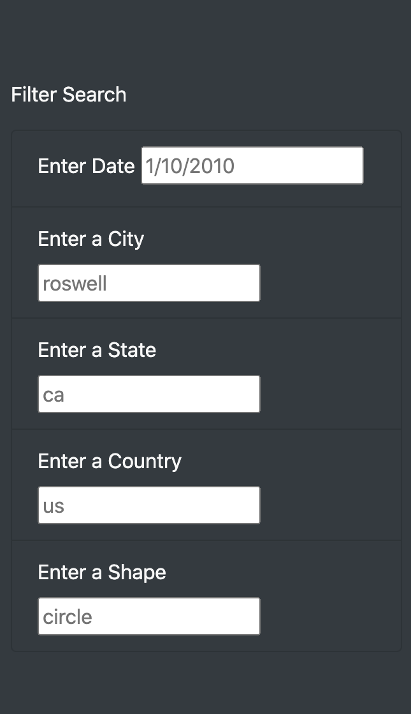
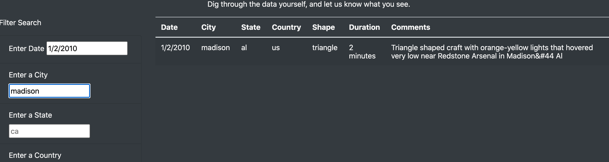

# UFOs

Dana who is a data journalist has given a task to write about her home town, McMinnville. McMinnville has an annual gathering of UFO enthusiasts. Dana is going to use her knowledge in html and javascript to display sightings data and also make it dynamic to allow the visitor to filter data on data, city, state, country and shape.

Results:
 When users logs into the webpage, they will notice some initial titles . The large main title The Truth is Out There on a dark space image background . The main text of the webpage starts with the phrase Are we alone in the universe? encourage users to read the text and browse more.
On the dynamic side, the users are displayed a table of Ufo sightings with attributes as shown bellow:

 

by using the input boxes, user will displayed the filtered data:

 

Summary:

-To start a new search we need to reload the page. It is better to use a button to clear the fields.

-For some search areas like country, it is a good idea to change the input box to drop down list.
